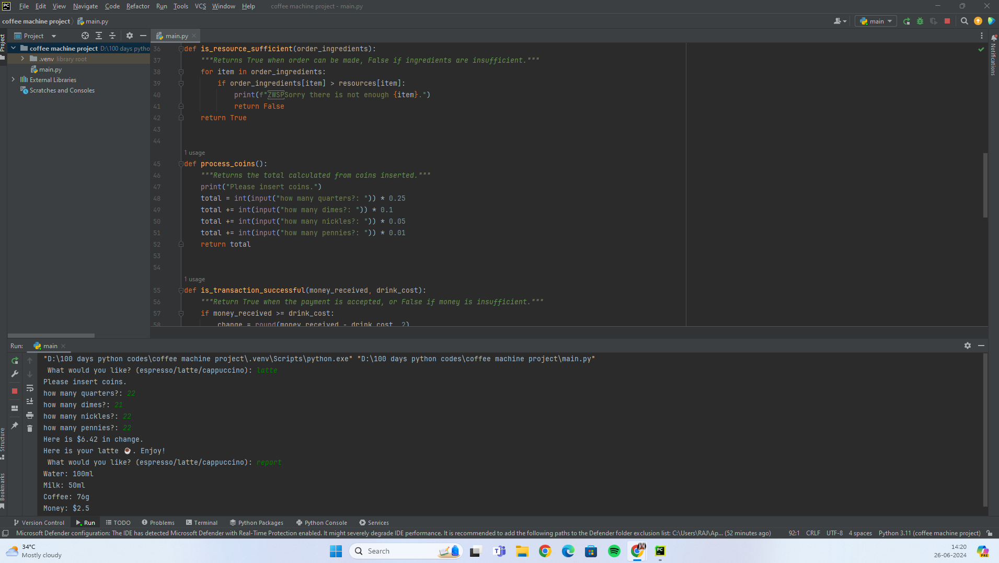

# Simple Coffee Machine Program Project :-

- Overview:

This is a Python program that simulates a coffee machine. It offers three types of coffee: espresso, latte, and cappuccino. The program manages resources (water, milk, and coffee), processes user payments, checks for sufficient resources, and provides coffee if all conditions are met.

- Components:

- MENU
The MENU dictionary contains information about the available coffee types. Each coffee type has ingredients and cost.

MENU = {
    "espresso": {
        "ingredients": {
            "water": 50,
            "coffee": 18,
        },
        "cost": 1.5,
    },
    "latte": {
        "ingredients": {
            "water": 200,
            "milk": 150,
            "coffee": 24,
        },
        "cost": 2.5,
    },
    "cappuccino": {
        "ingredients": {
            "water": 250,
            "milk": 100,
            "coffee": 24,
        },
        "cost": 3.0,
    }
}

- Resources:
The resources dictionary tracks the current amounts of water, milk, and coffee in the machine.

resources = {
    "water": 300,
    "milk": 200,
    "coffee": 100,
}

- Profit:
The profit variable tracks the total money earned by the machine.
profit = 0

- Functions:
'is_resource_sufficient(order_ingredients)'
This function checks if the machine has enough resources to make the selected drink.

def is_resource_sufficient(order_ingredients):
    """Returns True when order can be made, False if ingredients are insufficient."""
    for item in order_ingredients:
        if order_ingredients[item] > resources[item]:
            print(f"​Sorry there is not enough {item}.")
            return False
    return True

- process_coins():
This function prompts the user to insert coins and calculates the total amount of money inserted.

def process_coins():
    """Returns the total calculated from coins inserted."""
    print("Please insert coins.")
    total = int(input("how many quarters?: ")) * 0.25
    total += int(input("how many dimes?: ")) * 0.1
    total += int(input("how many nickles?: ")) * 0.05
    total += int(input("how many pennies?: ")) * 0.01
    return total

~ is_transaction_successful(money_received, drink_cost)
This function checks if the inserted money is sufficient to buy the selected drink. If the money is sufficient, it adds the drink cost to the profit and returns any change.

def is_transaction_successful(money_received, drink_cost):
    """Return True when the payment is accepted, or False if money is insufficient."""
    if money_received >= drink_cost:
        change = round(money_received - drink_cost, 2)
        print(f"Here is ${change} in change.")
        global profit
        profit += drink_cost
        return True
    else:
        print("Sorry that's not enough money. Money refunded.")
        return False

~ make_coffee(drink_name, order_ingredients)
This function deducts the required ingredients from the resources and prints a message that the coffee is ready.

def make_coffee(drink_name, order_ingredients):
    """Deduct the required ingredients from the resources."""
    for item in order_ingredients:
        resources[item] -= order_ingredients[item]
    print(f"Here is your {drink_name} ☕️. Enjoy!")

- Main Loop:-
The main loop of the program keeps running until the user turns off the machine. It processes user input to make a drink, show the report, or turn off the machine.

is_on = True

while is_on:
    choice = input("​What would you like? (espresso/latte/cappuccino): ")
    if choice == "off":
        is_on = False
    elif choice == "report":
        print(f"Water: {resources['water']}ml")
        print(f"Milk: {resources['milk']}ml")
        print(f"Coffee: {resources['coffee']}g")
        print(f"Money: ${profit}")
    else:
        drink = MENU[choice]
        if is_resource_sufficient(drink["ingredients"]):
            payment = process_coins()
            if is_transaction_successful(payment, drink["cost"]):
                make_coffee(choice, drink["ingredients"])

# Usage:
1.The program starts and asks the user what they would like: espresso, latte, or cappuccino.

2.If the user types "report", the program prints the current resource levels and profit.

3.If the user types "off", the program stops.

4.If the user selects a drink, the program checks if there are enough resources.

5.If resources are sufficient, the user is prompted to insert coins.

6.The program checks if the inserted money is enough.

7.If the transaction is successful, the drink is made, resources are updated, and the user receives their drink with any change.

This program provides a simple simulation of a coffee vending machine, handling resource management, user payments, and making drinks based on the available resources.

# Conclusion:-
1. This coffee machine program effectively simulates the operations of a coffee vending machine. It demonstrates several key programming concepts, such as:

2. Data Management: The use of dictionaries to store menu items and resources provides an efficient way to manage data and access information quickly.

3. Conditional Logic: The program uses conditional statements to make decisions based on user input and resource availability, ensuring that the machine operates smoothly and provides appropriate feedback to the user.

4. User Interaction: By prompting the user for input and processing coins, the program mimics real-world interactions, enhancing user engagement and providing a realistic experience.

5. Resource Management: The program keeps track of the resources (water, milk, coffee) and updates their quantities as drinks are made. It also ensures that drinks are only made if there are sufficient resources available.

6. Error Handling: The program handles errors gracefully by informing the user when resources are insufficient or when the inserted money is not enough.

7. Modularity: The use of functions to handle specific tasks (e.g., checking resources, processing coins, making coffee) makes the code modular and easier to maintain and extend.

Overall, this program is a comprehensive example of how to build a small yet functional application that manages resources, processes transactions, and interacts with users. It can be extended further to include more drink options, additional features like refilling resources, or integrating a more sophisticated payment system. This project serves as a practical exercise in combining various programming skills to create a useful and interactive application.

# Output:-
<h1 align="center">
   <a href="https://google.com">
    
   
    
</h1>

# Conclusion :-

